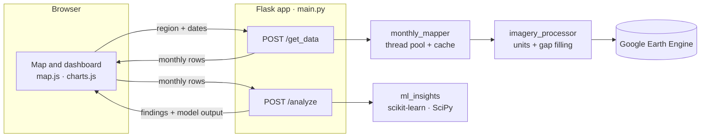

# ATMOS — Earth & Carbon Intelligence

ATMOS estimates how much carbon a piece of land stores and absorbs, month by
month, for any area you draw on a map. It pulls satellite and weather data
from Google Earth Engine, turns it into carbon, climate and air-quality
figures, and then uses machine learning to explain what the numbers are doing:
what is unusual, what drives carbon uptake, and what the next few months are
likely to look like.

| At a glance | |
|---|---|
| **What it answers** | How much CO₂ does this area store and take up each month, and why does it change? |
| **Inputs** | A polygon or rectangle drawn on the map, and a date range |
| **Outputs** | Monthly carbon, temperature, rainfall and aerosol figures, charts, a data table and machine-learning findings |
| **Data sources** | Landsat 9, ESA WorldCover, MODIS GPP, Sentinel-5P, ECMWF IFS (all via Google Earth Engine) |
| **Time range** | Monthly resolution, up to 60 months per query |
| **Stack** | Flask · Earth Engine Python API · pandas · XGBoost · scikit-learn · SciPy · Leaflet · Chart.js |
| **Accounts needed** | A Google Earth Engine account only; maps and front-end libraries need no API keys |

---

## Contents

- [What ATMOS does](#what-atmos-does)
- [Features](#features)
- [Using the app](#using-the-app)
- [The dashboard](#the-dashboard)
- [Metrics and data sources](#metrics-and-data-sources)
- [Machine-learning insights](#machine-learning-insights)
- [Architecture](#architecture)
- [API reference](#api-reference)
- [Front end](#front-end)
- [Setup and configuration](#setup-and-configuration)
- [Verification](#verification)
- [Limitations and assumptions](#limitations-and-assumptions)
- [Glossary](#glossary)

---

## What ATMOS does

Measuring carbon on the ground is slow and expensive. ATMOS gives a fast,
repeatable first estimate from open Earth-observation data, for anyone who
needs to understand an area's vegetation, carbon and climate over time:
environmental analysts, researchers, land and city planners, and students.

For a region and period you choose, ATMOS:

1. **Measures** vegetation carbon (above-ground biomass and gross primary
   production), air temperature, rainfall and absorbing aerosols for every
   month.
2. **Combines** them into a monthly carbon balance in kilograms of CO₂.
3. **Explains** the series with five machine-learning analyses that report
   their own reliability.
4. **Presents** everything in a responsive dashboard: headline figures,
   interactive charts and an exact data table.

---

## Features

### Region and time selection
- Draw a **polygon or rectangle** anywhere on an interactive street map; edit
  or delete it at any time.
- The selected region's **geodesic area** is shown as you draw (km² or m²).
- Pick any **start and end date**, or use the *Last 3 / 6 / 12 months*
  presets. The date fields prevent an end date before the start date or in the
  future.
- Queries run **only when you press Submit**. Drawing or editing never sends
  a request on its own.

### Earth-observation metrics
- **Above-ground biomass CO₂** from Landsat 9 vegetation greenness and ESA land
  cover.
- **Gross primary production (GPP) CO₂**, the carbon plants absorb through
  photosynthesis, from MODIS.
- **Absorbing aerosol index** (dust and smoke) from Sentinel-5P.
- **Air temperature** and **precipitation** from the ECMWF weather model.
- Every value has a verified unit; see [Metrics and data sources](#metrics-and-data-sources).

### Machine-learning insights
- **Forecast** of the next three months with a 95% interval.
- **Anomaly detection** that flags unusual months and names the cause.
- **Driver analysis** showing which climate factor moves carbon uptake.
- **Climate regimes** that group months into distinct weather patterns.
- **Trend tests** that separate real trends from noise.
- Each finding carries a **confidence level**, and analyses that don't have
  enough data are skipped with the reason stated.

### Dashboard and visualisation
- Four **headline tiles**, nine **interactive charts** and an exact **monthly
  data table**.
- Hover tooltips with a crosshair, a forecast toggle, and anomaly markers in
  the table.
- A colour palette checked for colour-blind separation and contrast.

### Responsive and accessible
- Distinct layouts for phones, rotated phones, tablets, laptops, desktops,
  portrait monitors and 21:9 ultrawide screens.
- Text and spacing scale smoothly with the screen; touch targets are 44 px.
- Live status announcements for screen readers, a captioned data table and
  reduced-motion support.

### Performance and reliability
- All months and datasets are fetched **in parallel**.
- Results are **cached per month**, so changing one end of the date range
  reuses everything already computed.
- Front-end libraries are **bundled locally**; the map falls back to a
  second tile server if the first fails.
- A new query cancels the previous one, and results that no longer match the
  inputs are flagged rather than shown silently.

---

## Using the app

The workflow is a fixed sequence:

1. **Draw a region.** Use the polygon or rectangle tool on the map's left edge.
   The pill under the date fields changes from *No region selected* to, for
   example, *ROI · 895 km²*. The pencil and bin tools edit or delete the shape.
2. **Choose a date range.** The range defaults to the last six months. Type
   dates or use a preset.
3. **Press Submit.** The button is enabled only when a region and both dates
   are set, and stays disabled while a query runs. The first query for a
   region takes the longest because Earth Engine does the heavy computation.
4. **Read the results.** Headline tiles and charts appear as soon as the data
   arrives; the machine-learning insights fill in about a second later.
5. **Refine.** Change the region or dates and press Submit again. Months that
   were already computed for the same region are served from the cache.

### Status messages

The pill in the header always tells you what the app is doing.

| Status | Meaning |
|---|---|
| *Awaiting region* | No region has been drawn yet. |
| *Region ready — press Submit* | A region and dates are set; nothing has been queried. |
| *Querying Earth Engine…* | A query is running. The previous results stay visible, dimmed. |
| *12 months analysed* | Results are shown for the current inputs. |
| *Inputs changed — press Submit to update* | The region or dates changed after the results were produced. |
| *Results up to date* | The inputs were changed back to match the results on screen. |
| *No data for this range* | Earth Engine returned no months for the request. |
| *Analysis failed* | The request failed; a message at the bottom of the screen explains why. |

---

## The dashboard

### Headline tiles

| Tile | How it is computed |
|---|---|
| **Mean monthly balance** (kg CO₂) | Average of the monthly carbon balance. An average, not a sum, because the balance includes the biomass stock, which would otherwise be counted once per month. |
| **Mean temperature** (°C) | Average of the monthly mean temperatures. |
| **Total precipitation** (mm) | Sum of the monthly totals. |
| **Mean aerosol index** (dimensionless) | Average of the monthly means. |

Tiles show three significant figures (for example *24.2 °C*); exact values are
in the table.

### Charts

| Chart | Form | What it shows |
|---|---|---|
| **Net carbon balance** | Bars around zero | Monthly balance; blue for a net sink, red for a net source |
| **Above-ground biomass CO₂** | Filled line | CO₂ stored in vegetation across the region |
| **Gross primary production CO₂** | Filled line | CO₂ taken up by photosynthesis each month |
| **Air temperature** | Filled line | Region-mean temperature at 2 m |
| **Precipitation** | Bars | Region-mean rainfall per month |
| **Absorbing aerosol index** | Filled line | Dust and smoke levels |
| **Forecast** | Line, dashed forecast, shaded band | Observed series, three-month forecast and 95% interval; toggle between GPP, temperature and rain |
| **What drives GPP uptake** | Horizontal bars around zero | Effect of each climate factor; blue raises uptake, red lowers it |
| **Climate regimes** | Scatter plot | Each month by temperature and rainfall, coloured by regime |

All charts share one interaction model: hovering anywhere in a column shows
that month's values with a crosshair, and line charts label their peak value.
Every plotted value is also available in the table.

### Monthly summary table

One row per month with biomass CO₂, GPP CO₂, aerosol index, carbon balance,
temperature and precipitation. Months flagged by the anomaly model are
highlighted with ⚠; hovering the row explains which variable was unusual and
by how much.

---

## Metrics and data sources

Each metric is computed from about 300 randomly sampled pixels per image.
Samples are always **averaged, never summed**; region totals in kilograms are
the average per square metre multiplied by the region's area.

| Metric | Dataset (Earth Engine ID) | Band and native unit | Sampling scale | Reported as |
|---|---|---|---|---|
| Biomass CO₂ | `LANDSAT/LC09/C02/T1_L2` + `ESA/WorldCover/v200` | `SR_B4`, `SR_B5` reflectance (DN × 2.75 × 10⁻⁵ − 0.2); land-cover class | 30 m (land cover 10 m) | kg CO₂, region total (stock) |
| GPP CO₂ | `MODIS/061/MYD17A2H` | `Gpp`, kg C/m² per 8 days (DN × 0.0001) | 500 m | kg CO₂, region total per month |
| Aerosol index | `COPERNICUS/S5P/OFFL/L3_AER_AI` | `absorbing_aerosol_index`, dimensionless | 1 km | Region mean |
| Temperature | `ECMWF/NRT_FORECAST/IFS/OPER` | `temperature_2m_sfc`, °C | 1 km (native 0.25°) | °C, region mean |
| Precipitation | `ECMWF/NRT_FORECAST/IFS/OPER` | `total_precipitation_sfc`, m, cumulative per forecast run | 1 km (native 0.25°) | mm, region mean per month |

### Above-ground biomass (AGB)

1. Build a median Landsat 9 composite from scenes with under 20% cloud cover
   and compute NDVI from the red (`SR_B4`) and near-infrared (`SR_B5`) bands.
2. Look up each sampled pixel's ESA WorldCover class and apply a linear
   NDVI-to-biomass model, clamped at zero:

   | Land cover (WorldCover code) | Biomass model |
   |---|---|
   | Tree cover (10) | 10 000 × NDVI − 5 000 |
   | Grassland (30) | 2 000 × NDVI − 1 000 |
   | Cropland (40) | 5 000 × NDVI − 2 000 |
   | Built-up (50) and all other classes | 0 |

3. Convert to CO₂: model output (assumed g/m²) × 0.001 → kg/m², × 0.47 carbon
   fraction, × 3.67 CO₂-to-carbon mass ratio.
4. Pixels with zero or negative biomass are gap-filled by an XGBoost model
   trained on NDVI and land cover; the mean is multiplied by the region area.

### Gross primary production (GPP)

MODIS reports GPP as an 8-day total. ATMOS averages the composites in the
month, scales by *days in window ÷ 8*, converts carbon to CO₂ (× 3.67), and
multiplies the regional mean by the area.

### Air temperature and precipitation

The ECMWF model publishes a new forecast run every 12 hours.

- **Temperature** averages the 0, 3, 6 and 9-hour steps of every run. Two runs
  a day make this a true daily mean at the shortest forecast lead times. The
  band is already in °C.
- **Precipitation** is cumulative from the start of each run, so the 12-hour
  value is exactly the rain in that run's first 12 hours. The monthly total is
  the average 12-hour amount × the number of 12-hour periods, converted to mm.
  This stays correct when individual runs are missing.
- ECMWF data in Earth Engine starts on **12 November 2024**; earlier months
  have no temperature or precipitation.

### Absorbing aerosol index

A median Sentinel-5P image for the month, averaged over the region. The index
has no unit: positive values indicate UV-absorbing particles such as dust and
smoke.

### Carbon balance

**Carbon balance = biomass CO₂ + GPP CO₂** (kg CO₂). The aerosol index is
reported separately rather than subtracted, because a dimensionless index
cannot be added to or taken from a mass.

### Gap filling

Where a sample has missing values, an XGBoost regressor (150 trees, depth 4,
learning rate 0.05) predicts them from the other columns: NDVI and land cover
for biomass, latitude and longitude for the other metrics. Observed values are
never overwritten.

---

## Machine-learning insights

The insights run on the monthly series the dashboard already holds, through a
separate endpoint (`POST /analyze`). They make no Earth Engine calls, so a year
of data is analysed in about a second. The charts appear first and the
insights fill in when ready.

Monthly series are short, often a few dozen points at most. Every method was
chosen to stay robust at small sample sizes, and every one checks itself
before it reports anything.

| Analysis | Method | Minimum data | Self-check |
|---|---|---|---|
| **Forecast** | Gaussian-process regression | 4 months | Hides the last month, forecasts it, and reports the error and whether it fell inside the 95% interval (6+ months) |
| **Anomalies** | Isolation Forest + modified z-score | 5 months | A month is flagged only when both methods agree |
| **Drivers** | Ridge regression | 6 complete months | Scored on months it never saw (leave-one-out R²); warns when drivers move together |
| **Climate regimes** | k-means clustering | 6 months | Kept only if the clusters are genuinely distinct (silhouette ≥ 0.25) |
| **Trends** | Theil–Sen slope + Kendall tau test | 4 months | Called a trend only when statistically significant (p < 0.05) |

### Forecast

- Forecasts **GPP uptake, temperature and precipitation**; the chart toggles
  between them.
- Kernel: constant × RBF (starting length scale max(2, n ÷ 3) months, bounded
  1–60) + white noise, on a normalised target, with three optimiser restarts.
- Horizon of **three months**, with a 95% interval of mean ± 1.96 σ. GPP and
  precipitation are never forecast below zero.
- Gaps in the series keep their true spacing in time.
- With few points the forecast drifts back toward the average and the interval
  widens. This is deliberate: it is the honest answer when data is thin.
- **Confidence:** *high* when the interval is narrower than 30% of the forecast
  and the held-out month landed inside its interval; *medium* below 80%;
  otherwise *low*.

### Anomalies

- Checks **GPP uptake, temperature, precipitation and the aerosol index**.
- Uses the **modified z-score**, 0.6745 × (value − median) ÷ median absolute
  deviation. Unlike a standard z-score, an extreme month cannot hide itself by
  inflating the spread.
- **Under 8 complete months:** the z-score alone, at the standard cut-off of
  |z| ≥ 3.5.
- **8 months or more:** an Isolation Forest (300 trees on robust-scaled data)
  proposes candidates, including unusual *combinations* such as hot and dry at
  once. A candidate is confirmed only if its most extreme variable reaches
  |z| ≥ 2.5.
- Each flag names the variable, whether it was high or low, and its z-score.
  The three strongest become findings and every flagged month is marked in the
  table. **Confidence:** *high* when |z| ≥ 5, otherwise *medium*.

### Drivers of carbon uptake

- Asks which of **temperature, precipitation and the aerosol index** best
  explains month-to-month changes in GPP uptake.
- Standardised ridge regression, with the regularisation strength chosen from
  30 values between 0.01 and 1 000.
- Effects are reported in standard deviations. For example, *one standard
  deviation more rainfall raises uptake by 0.8 standard deviations*. The
  tooltip adds each driver's Spearman rank correlation.
- Scored by **leave-one-out R²**: every month is predicted by a model that never
  saw it, so a model that merely memorises a short series scores near zero.
  *Strong* ≥ 0.5, *moderate* ≥ 0.2, *weak* below that. A weak model produces
  *No reliable climate driver* instead of a claim.
- **Collinearity check:** when two drivers have a linear correlation of
  |r| ≥ 0.8, their separate effects cannot be told apart. The finding says so
  and its confidence is capped at *medium*.

### Climate regimes

- Standardises temperature and precipitation, then runs k-means for two and
  three clusters (three needs at least 9 months), 20 initialisations each.
- Keeps the grouping with the best **silhouette score** and discards it below
  0.25, where "clusters" are an artefact of forcing a split.
- Regimes are ordered coolest to warmest, so their colours stay stable between
  runs.
- Named against the period's medians (*Warm & wet*, *Cool & dry*); two regimes
  with the same name are told apart as *· hotter* and *· milder*.
- Reports mean GPP uptake per regime and the ratio between the most and least
  productive. **Confidence:** *high* when silhouette ≥ 0.5.

### Trends

- Tests every metric with at least four changing values, using the **Theil–Sen
  slope** (the median of all pairwise slopes, so outliers barely move it) and
  the **Kendall tau** test.
- Reported as *rising* or *falling* only when p < 0.05; otherwise *no clear
  trend*. With four months the test cannot reach significance at all, so short
  ranges never produce a trend claim.
- Rates are given as **% per month** for GPP, biomass and precipitation, and in
  **absolute units per month** for temperature and the aerosol index, where a
  percentage would be meaningless.
- **Confidence:** *high* when p < 0.01, otherwise *medium*.

### Findings

Results are summarised as plain-language findings, each with a kind, a title,
a sentence and a confidence level, sorted from high to low confidence.

| Kind | Example (from a sample year of data) |
|---|---|
| Anomaly | *2025-07 stands out:* Precipitation was unusually high (190 mm, modified z = +8.6; Isolation Forest + modified z-score). |
| Driver | *Precipitation drives uptake:* one standard deviation more raises GPP uptake by 1.00 SD (ridge regression, leave-one-out R² = 1.00, n = 12). |
| Regime | *Climate regimes:* 3 distinct climate regimes (k-means, silhouette 0.58). Warm & wet months take up 2.1× more CO₂ than cool & dry months. |
| Forecast | *Forecast for 2026-01:* GPP uptake is forecast at 24.67M kg CO₂ (95% interval 13.33M–36.01M). Held-out check: off by 10%. |
| Trend | *No clear trends:* no metric shows a statistically clear trend over 12 months (Kendall test, p ≥ 0.05). |
| Data | *Short series:* only 3 months of data; drivers and climate regimes need at least 6. |

Any analysis that cannot run is listed under the findings with its reason, for
example *drivers (needs ≥ 6 complete months)*.

---

## Architecture



### Request lifecycle

1. The browser sends the region and dates to `POST /get_data`.
2. `main.py` validates the request: a JSON object, a coordinate list, dates in
   `YYYY-MM-DD`, a start before the end, and no more than 60 months.
3. `monthly_mapper.py` splits the range into calendar months, clamped to the
   end date, and submits four tasks per month (biomass, GPP, aerosol, weather)
   to a pool of 10 threads.
4. Each task returns a cached result if the same dataset, region and month was
   computed before; otherwise `imagery_processor.py` queries Earth Engine,
   converts units and gap-fills with XGBoost.
5. The server returns one row per month; the browser renders the tiles, charts
   and table.
6. The browser sends the same rows to `POST /analyze`; `ml_insights.py` returns
   findings and model output, which the browser renders and uses to mark
   anomalous rows.

### Project structure

```
ATMOS_NEW/
├── Backend/
│   ├── main.py               Flask app: routes and request validation
│   ├── config.py             Settings read from environment variables
│   ├── ee_client.py          Lazy, thread-safe Earth Engine initialisation
│   ├── monthly_mapper.py     Month ranges, parallel fetching, per-month cache
│   ├── imagery_processor.py  Earth Engine extraction and unit conversion
│   ├── randomForestCalcs.py  XGBoost gap filling
│   ├── ml_insights.py        Forecast, anomalies, drivers, regimes, trends
│   ├── requirements.txt      Python dependencies
│   ├── plot.py               Legacy plotting helper, not used by the app
│   └── imagery_plotter.py    Legacy plotting helper, not used by the app
├── static/
│   ├── map.js                Map, inputs, requests and app state
│   ├── charts.js             Tiles, charts, table and insights rendering
│   ├── map.css               Styles and responsive layouts
│   └── vendor/               Leaflet 1.9.4, Leaflet.draw 1.0.4, Chart.js 4.4.3
├── templates/
│   └── map.html              Page markup
├── .env.example              Configuration template (committed)
├── .env                      Your own settings (git-ignored)
├── ATMOS.md                  Setup and run instructions
└── ATMOS_OVERVIEW.md         This document
```

`.gitignore` keeps the virtual environment, Python caches, `.env` and local
editor settings out of version control.

### Performance design

- **Parallel fetching.** Every month-and-dataset pair runs in one bounded
  thread pool (10 workers by default, within Earth Engine's concurrency
  limits) instead of one request after another.
- **One weather query per month** serves both temperature and precipitation.
- **Per-month cache** keyed by dataset, a SHA-1 fingerprint of the region and
  the date window; up to 2 048 entries. Region areas are cached separately.
- **Lazy Earth Engine start-up.** The connection opens on the first request,
  safely across threads; the browser sign-in runs only if no stored
  credentials exist.
- **Clamped month windows**, so no imagery outside the requested range is
  processed.
- **Insights without Earth Engine**: about 1.3 seconds for 12 months, measured
  over HTTP.

---

## API reference

All endpoints exchange JSON. Errors return `{"error": "<message>"}`.

### `GET /`

Serves the dashboard.

### `GET /health`

Returns `{"status": "ok"}`.

### `POST /get_data`

Computes the monthly series for a region and date range.

**Request**

```json
{
  "coords": [[[74.20, 31.40], [74.50, 31.40], [74.50, 31.70], [74.20, 31.70], [74.20, 31.40]]],
  "startDate": "2025-01-01",
  "endDate": "2025-07-01"
}
```

`coords` is a GeoJSON polygon coordinate array of `[longitude, latitude]`
pairs with the outer ring first, exactly as the map produces it.

**Response:** one object per month. The values below are from a real run over
a 15 km box around Lahore for June 2025.

```json
[
  {
    "month": "2025-06",
    "AGB_CO2_kg": 295884436.67,
    "GPP_CO2_kg": 32556096.71,
    "UVAI_index": 0.4055,
    "Carbon_Balance_kg": 328440533.38,
    "Temperature_C": 33.03,
    "Precipitation_mm": 75.16
  }
]
```

| Field | Unit | Notes |
|---|---|---|
| `month` | `YYYY-MM` | First day of the window's month |
| `AGB_CO2_kg` | kg CO₂ | Biomass stock, region total |
| `GPP_CO2_kg` | kg CO₂ | Uptake during the window, region total |
| `UVAI_index` | dimensionless | Region mean |
| `Carbon_Balance_kg` | kg CO₂ | `AGB_CO2_kg + GPP_CO2_kg` |
| `Temperature_C` | °C | Region mean; `null` when no ECMWF data (before 2024-11-12) |
| `Precipitation_mm` | mm | Region mean monthly total; `null` when no ECMWF data |

| Status | When |
|---|---|
| `400` | Body is not a JSON object; `coords` missing or not a list; a date missing or not `YYYY-MM-DD`; start not before end; more than 60 months |
| `500` | Unexpected server error |

If one dataset fails for one month, that value falls back (0 for carbon and
aerosol, `null` for weather) instead of failing the whole request.

### `POST /analyze`

Runs the machine-learning insights over monthly rows.

**Request**

```json
{ "rows": [ { "month": "2025-06", "GPP_CO2_kg": 32556096.71, "Temperature_C": 33.03, "...": "..." } ] }
```

**Response**

| Key | Contents |
|---|---|
| `n_months` | Number of months analysed |
| `findings` | `[{kind, title, text, confidence}]`, sorted by confidence |
| `trends` | Per metric: `slope_per_month`, `pct_per_month`, `kendall_tau`, `p_value`, `significant`, `direction`, `n` |
| `anomalies` | `{method, threshold, months: [{month, metric, label, unit, value, modified_z, direction}]}`, or `null` |
| `drivers` | `{target, n, r2_loo, reliability, drivers: [{metric, label, effect_sd, spearman_rho, spearman_p}], collinear}`, or `null` |
| `forecasts` | Per metric: `{label, unit, history, forecast: [{month, mean, lower, upper}], backtest}` |
| `regimes` | `{found, k, silhouette, groups, points}`, `{found: false, silhouette}`, or `null` |
| `skipped` | `[{analysis, reason}]` for analyses that could not run |

Numbers that cannot be computed are returned as `null`, never `NaN`.

| Status | When |
|---|---|
| `400` | `rows` missing, empty, not a list of objects, or longer than 60 |
| `500` | Unexpected server error |

---

## Front end

### Design system

The interface is a dark dashboard built on a small set of colour tokens:
background `#0d1014`, card surface `#1b222d`, primary text `#e9eff7`. Chart
colours were checked for colour-blind separation and contrast against the
card surface.

| Colour | Hex | Used for |
|---|---|---|
| Blue | `#3987e5` | Carbon series, net sink, precipitation, first climate regime |
| Orange | `#d95926` | Temperature, second climate regime |
| Aqua | `#199e70` | Aerosol index, third climate regime |
| Red | `#e66767` | Net source and "lowers uptake", always paired with blue |

- Blue and red stay clearly distinct for red–green colour blindness (colour
  difference 19.2 against a target of 8) and for full colour vision (29.0
  against a floor of 15).
- The regime scatter never uses more than three colours: a fourth would fail
  the colour-blind separation check for at least one pair.
- Meaning never relies on colour alone. Legends, labels and confidence levels
  are always written out.
- Large numbers use compact notation (*32.56M*), tiles show three significant
  figures, and the table shows exact values with aligned digits.

### Responsive layouts

| Screen | Layout |
|---|---|
| Desktop and laptop (≥ 1200 px wide, landscape) | Map on the left (38%), fixed in place while the dashboard scrolls |
| Small laptop or landscape tablet (900–1199 px) | Narrower map (40%); headline tiles in a 2 × 2 grid |
| Portrait tablet, phone or portrait monitor | Single column, map on top, sized from the shorter side of the screen |
| Tall portrait monitor (≥ 1100 px high) | Taller map, up to 760 px |
| Rotated phone (landscape, ≤ 540 px high) | Map and dashboard side by side; compact inputs keep Submit on screen; the header scrolls away |
| Ultrawide (≥ 1900 px wide, 2:1 or wider) | Map at 30%; charts arranged as a two-column board |
| Phone (≤ 560 px) | Headline tiles in two columns |
| Small phone (≤ 400 px) | Date fields stacked; subtitle hidden |

- Text scales smoothly from about 13 px on phones to 15.5 px on large screens,
  and spacing and chart heights scale with it.
- Cards rearrange by their own width (container queries), so a chart in a
  narrow column adapts even on a wide screen.
- Touch screens get 44 px targets and 16 px inputs, which stops iOS zooming in
  on focus.
- Content stays clear of notches and rounded screen corners.
- The map redraws whenever its container changes size, including device
  rotation and split-screen.

### Accessibility

- Status changes are announced to screen readers; errors are announced as
  alerts.
- The data table has a caption, and every chart value is also in the table.
- Inputs and the forecast toggle show a visible keyboard focus; the toggle is a
  labelled tab list.
- Animation is turned off for people who have asked their system for reduced
  motion.

### Maps and bundled assets

- **Basemap:** OpenStreetMap Germany street tiles, switching automatically to
  OpenStreetMap Humanitarian if they fail to load. Neither needs an API key or
  an account.
- **Libraries:** Leaflet, Leaflet.draw and Chart.js are served by the app
  itself, so the page works on networks that block content delivery networks.
  Only map tiles need the browser to reach the internet.

### Resilience

- Submitting again cancels the running query; the newest request wins.
- If the region or dates change while a query runs, the results still appear
  but the status marks them as out of date.
- During a new query the previous results stay visible at reduced opacity
  instead of flashing to empty placeholders.
- If the insights fail, the charts and table are unaffected; the insights panel
  reports the failure.

---

## Setup and configuration

Full instructions are in [ATMOS.md](ATMOS.md). In short, on Windows:

```powershell
py -m venv .venv
.\.venv\Scripts\Activate.ps1
pip install -r Backend/requirements.txt
Copy-Item .env.example .env       # then set EE_PROJECT inside it
earthengine authenticate          # once per machine
cd Backend
python main.py                    # then open http://127.0.0.1:5000
```

For a production-style server, run `python -m waitress --port=5000 main:app`
from `Backend/`. Tested with Python 3.13. A Google Earth Engine account with a
Cloud project is required.

### Configuration

Settings are environment variables, read from `.env`:

| Variable | Default | Effect |
|---|---|---|
| `EE_PROJECT` | *(required)* | Your Earth Engine Cloud project id |
| `SAMPLE_POINTS` | `300` | Pixels sampled per image; more is more precise but slower |
| `MAX_CLOUD_PCT` | `20` | Maximum Landsat scene cloud cover, in percent |
| `MAX_WORKERS` | `10` | Parallel Earth Engine requests |
| `AGB_MODEL_TO_KG_M2` | `0.001` | Unit of the biomass model's output (0.001 means grams per m²) |
| `NDVI_SCALE` | `30` | Landsat sampling scale, in metres |
| `GPP_SCALE` | `500` | MODIS sampling scale, in metres |
| `UVAI_SCALE` | `1000` | Sentinel-5P sampling scale, in metres |
| `WEATHER_SCALE` | `1000` | ECMWF sampling scale, in metres |
| `FLASK_DEBUG` | `0` | `1` turns on the Flask debugger and auto-reload |

---

## Verification

These checks were run during development. The repository does not yet include
an automated test suite.

| Area | Check | Result |
|---|---|---|
| Units | Live Earth Engine query over a 15 km box around Lahore for June 2025, compared with raw dataset values and climate normals | 10 of 10 passed: 33.0 °C, 75.2 mm, aerosol index 0.41, GPP 3.26 × 10⁷ kg CO₂ (0.33 g C/m² per day) |
| Backend | Import without sign-in prompts, month clamping, gap-filling edge cases, request validation | Passed |
| Machine learning | 19 tests on synthetic data with planted patterns: a rising trend, an extreme rainfall month, two climate regimes, rainfall-driven uptake, collinear drivers, short and gappy series | Passed |
| API | `/analyze` over HTTP with a 12-month series, plus invalid input | 200 in about 1.3 s with 6 findings; invalid input returns 400 |
| Layout | Headless Microsoft Edge at 360 × 740, 390 × 844, 844 × 390, 820 × 1180, 1024 × 768, 1366 × 768, 1920 × 1080, 1080 × 1920 and 2560 × 1080 | Renders as designed; three layout bugs found this way were fixed |

Not yet verified: physical touch devices. The layout screenshots used sample
monthly data with real machine-learning output, not live Earth Engine results.

---

## Limitations and assumptions

### Science and data

- **The carbon balance adds a stock to a flux.** Biomass is carbon standing in
  vegetation; GPP is carbon absorbed during the month. Both are in kg CO₂, but
  their sum is a simplification, not a net ecosystem carbon balance.
- **There is no emissions term.** Nothing in the model represents respiration,
  fire or fuel use, so the balance cannot go negative and the red *net source*
  state does not currently occur. A true balance needs an emissions or
  respiration dataset.
- **The biomass model is an assumption.** The NDVI coefficients and their unit
  (grams per m²) do not come from a documented source. Set
  `AGB_MODEL_TO_KG_M2` if the coefficients use a different unit.
- **Gap filling can add biomass to built-up land.** Pixels with zero modelled
  biomass, including urban areas and water, are imputed from vegetated pixels,
  which can overstate biomass in cities.
- **Figures are sample estimates.** Around 300 random pixels per image estimate
  each regional mean, so repeated runs can differ slightly.
- **Weather values are short-range forecasts**, not station observations, and
  start on 12 November 2024.
- **Missing carbon or aerosol data shows as 0**, which is indistinguishable
  from a real zero. Missing weather shows as blank.

### Machine learning

- Findings describe patterns and correlations within the chosen period, not
  causes.
- Short ranges limit what can be learned: drivers and regimes need at least 6
  months, and forecasts from short series are wide by design.

### Operations

- Results depend on Google Earth Engine availability and quotas; the first
  query for a region is the slowest.
- The cache lives inside the server process: it is lost on restart and not
  shared between multiple server processes.
- There are no user accounts or access controls; the app is meant for local or
  trusted-network use.
- The map tile servers are volunteer-run under fair-use policies. Heavy public
  traffic needs a paid or self-hosted tile service.

---

## Glossary

| Term | Meaning |
|---|---|
| **AGB** | Above-ground biomass: the dry mass of living vegetation above the soil |
| **GPP** | Gross primary production: carbon captured by photosynthesis over a period |
| **NDVI** | Normalised Difference Vegetation Index, (NIR − red) ÷ (NIR + red); higher means denser, greener vegetation |
| **Absorbing aerosol index** | Satellite measure of UV-absorbing particles such as dust and smoke; dimensionless |
| **ROI** | Region of interest: the area drawn on the map |
| **ECMWF IFS** | The global forecast model of the European Centre for Medium-Range Weather Forecasts |
| **× 3.67** | Converts a mass of carbon to CO₂: 44 g/mol for CO₂ ÷ 12 g/mol for carbon |
| **Theil–Sen slope** | The median of the slopes between every pair of points; resistant to outliers |
| **Kendall tau** | A rank-based test of whether values tend to rise or fall over time |
| **Modified z-score** | Distance from the median in units of median absolute deviation; robust to outliers |
| **Isolation Forest** | An anomaly detector that isolates unusual points using random splits |
| **Ridge regression** | Linear regression with a penalty that keeps coefficients stable on small data |
| **Leave-one-out R²** | Share of variation explained when every point is predicted by a model trained without it |
| **Collinearity** | Two predictors moving together so closely that their separate effects cannot be told apart |
| **Gaussian process** | A flexible model that forecasts with a built-in uncertainty interval |
| **Silhouette score** | From −1 to 1: how much closer points are to their own cluster than to the others |
| **XGBoost** | Gradient-boosted decision trees, used here to fill in missing pixel values |
