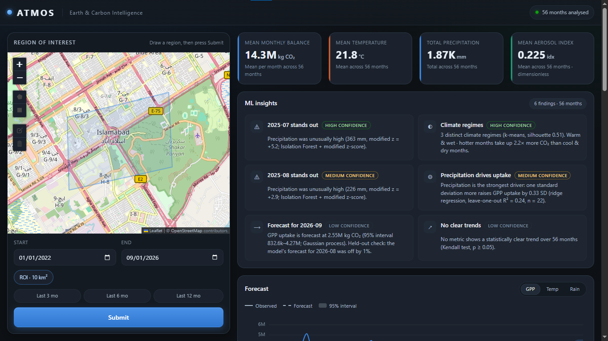

# ATMOS - Earth & Carbon Intelligence



Flask + Google Earth Engine dashboard that computes a monthly carbon balance,
temperature, precipitation and aerosol index for a drawn region of interest.

For the full description of features, data sources, units, machine-learning
methods and the API, see [ATMOS_OVERVIEW.md](ATMOS_OVERVIEW.md).

## Setup

```powershell
py -m venv .venv
.\.venv\Scripts\Activate.ps1
pip install -r Backend/requirements.txt

Copy-Item .env.example .env   # then fill in your values
```

## Earth Engine auth

Credentials are resolved lazily on the first request. If none are stored, the
browser auth flow starts automatically. To authenticate up front:

```powershell
earthengine authenticate
```

Set `EE_PROJECT` in `.env` to your own Cloud project. The app refuses to start
an Earth Engine session without it and says so.

`.env` holds the settings for your machine and is git-ignored;
`.env.example` is the committed template. Never commit `.env`.

## Run

```powershell
cd Backend
python main.py                      # development
python -m waitress --port=5000 main:app   # production
```

Open http://127.0.0.1:5000

## Configuration

All settings live in `.env` (see `.env.example`):

| Variable | Default | Purpose |
|---|---|---|
| `EE_PROJECT` | *(required)* | Your Earth Engine Cloud project id |
| `SAMPLE_POINTS` | 300 | Pixels sampled per image; higher = slower, more accurate |
| `MAX_WORKERS` | 10 | Parallel Earth Engine requests |
| `MAX_CLOUD_PCT` | 20 | Landsat cloud-cover ceiling |
| `AGB_MODEL_TO_KG_M2` | 0.001 | Unit of the NDVI->AGB regression (0.001 = g/m2) |
| `FLASK_DEBUG` | 0 | Set to 1 for the reloader + debugger |

## Layout

```
Backend/
  main.py               Flask routes + request validation
  config.py             env-driven settings
  ee_client.py          lazy, thread-safe Earth Engine init
  monthly_mapper.py     parallel month aggregation + per-month cache
  imagery_processor.py  NDVI/AGB, GPP, UVAI, weather extraction
  randomForestCalcs.py  XGBoost gap-filling
static/
  map.js                map, date range, request orchestration
  charts.js             Chart.js rendering, stat tiles, table view
  map.css               dashboard styling
  vendor/               Leaflet 1.9.4, Leaflet.draw 1.0.4, Chart.js 4.4.3
                        (served locally - no CDN needed at runtime)
templates/
  map.html
```

## API

`POST /get_data`

```json
{ "coords": [[[lon, lat], ...]], "startDate": "2024-01-01", "endDate": "2024-06-01" }
```

Returns one object per month:

```json
[{ "month": "2025-06", "AGB_CO2_kg": 0.0, "GPP_CO2_kg": 0.0,
   "UVAI_index": 0.0, "Carbon_Balance_kg": 0.0,
   "Temperature_C": null, "Precipitation_mm": null }]
```

### Units

| Field | Unit | Derived from |
|---|---|---|
| `AGB_CO2_kg` | kg CO2, region total (stock) | Landsat 9 NDVI + ESA WorldCover regression; regression unit assumed g/m2 |
| `GPP_CO2_kg` | kg CO2, region total for the month | MODIS MYD17A2H `Gpp` x 0.0001 = kg C/m2 per 8 days |
| `UVAI_index` | dimensionless, region mean | Sentinel-5P `absorbing_aerosol_index` |
| `Carbon_Balance_kg` | kg CO2 | `AGB_CO2_kg + GPP_CO2_kg` |
| `Temperature_C` | deg C, region mean | ECMWF IFS `temperature_2m_sfc` (native deg C) |
| `Precipitation_mm` | mm, region mean monthly total | ECMWF IFS `total_precipitation_sfc` (m, cumulative per forecast run) |

ECMWF data starts 2024-11-12; earlier months return `null` for temperature
and precipitation.

`POST /analyze` — ML insights over rows already returned by `/get_data`
(no Earth Engine calls, so it is fast to re-run):

```json
{ "rows": [ { "month": "2025-06", "GPP_CO2_kg": 3.2e7, "Temperature_C": 33.0, ... } ] }
```

| Analysis | Method | Minimum data |
|---|---|---|
| Trends | Theil–Sen slope + Kendall tau test | 4 months |
| Anomalies | Isolation Forest, confirmed and explained by a modified z-score | 5 months |
| Drivers of GPP | Ridge regression, scored by leave-one-out R²; flags collinear drivers | 6 months |
| Forecast (3 months) | Gaussian-process regression with 95% interval + held-out backtest | 4 months |
| Climate regimes | k-means on temperature × precipitation, kept only if silhouette ≥ 0.25 | 6 months |

Returns `findings` (plain-language, each with a `confidence`), the raw
results of each analysis, and `skipped` with the reason any analysis
could not run.

`GET /health` -> `{"status": "ok"}`

